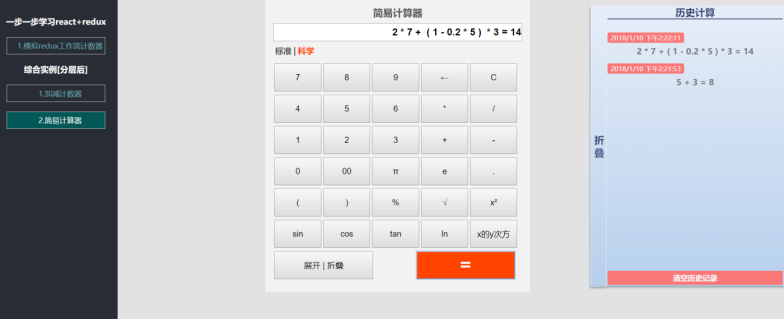

# Redux-Demo 计算器


## 效果图




## 功能
+  简单的+-*/
+  带括号的四则运算
+  科学计算器功能:sin cos % lg 等
+  抛错处理
+  查看/清除计算记录


## 运行
```
git clone https://github.com/EmilyYoung71415/LearnReactDemo  

cd LearnReactDemo

cd redux-demo

npm install

npm start
```

## 项目结构
```
├──redux-demo/                 * 计算器Demo
      |
      |————src/                * 主程序
            │
            ├─Components       * 所有组件 
            │  ├─Calculator    * 计算器
            │  ├─Counter       * 计数器 
            │  └─StudyDemos    * 学习的一些有帮助的demo 
            │      └─备份文件夹 * 笔记 等我写完博客就清 
            ├─Error            * 错误组件 
            ├─Redux            * Redux 
            │  ├─Action
            │  ├─Containers
            │  ├─Reducer
            │  └─Store
            ├─Router           * 路由
            └─Style            * 所有样式变量 
```
## 个人感悟
